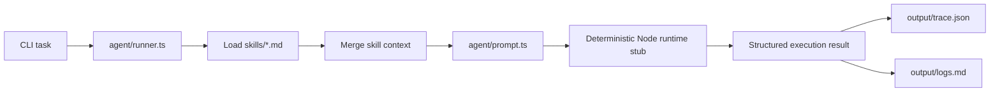
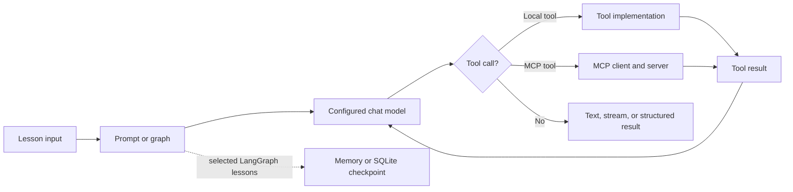

# Agent Engineering Lab

Practical TypeScript and JavaScript examples for learning modern AI agent engineering with runnable, inspectable code.

## What is this?

Agent Engineering Lab is an open-source learning and experimentation repository for TypeScript and JavaScript developers. It is not a production-ready agent framework. Instead, it keeps agent patterns small enough to inspect: prompt construction, tools, structured output, memory, graph orchestration, MCP integration, streaming, and runtime traces.

The repository has two layers:

- A lightweight root runner that loads Markdown skills, builds a prompt context, executes a deterministic local runtime stub, and writes a trace.
- Independent lessons that exercise LangChain, LangGraph, MCP, model APIs, storage, speech, and UI integration. Some lessons require external credentials or services.

## Features

| Capability                             | Status       | Where                                                                                     | Notes                                                                                                                               |
| -------------------------------------- | ------------ | ----------------------------------------------------------------------------------------- | ----------------------------------------------------------------------------------------------------------------------------------- |
| Skill loading and prompt assembly      | Implemented  | `agent/` and `skills/`                                                                    | The root runner loads every top-level Markdown skill before execution.                                                              |
| Local agent runner and execution trace | Implemented  | `agent/runner.ts`                                                                         | Runs without an API key; writes ignored runtime artifacts to `output/trace.json` and `output/logs.md`. The runtime response is deterministic, not LLM-generated. |
| Prompt templates and LCEL/Runnables    | Experimental | `lessons/14_prompt-template-test`, `15_runnable-test`, `16_LCEL-chain`                    | Runnable learning examples; model-backed cases require credentials.                                                                 |
| Tool calling and tool loops            | Experimental | `lessons/01_tool-test`, `13_mini_cursor`, `20_nest+openclew`, `23_langgraph-test`         | Includes local tools and explicit model-tool loops.                                                                                 |
| Structured output with Zod             | Experimental | `lessons/12_output-parser-test`, `13_mini_cursor`                                         | Covers parsers, tool-call arguments, fallback behavior, and streaming.                                                              |
| MCP server and LangChain client        | Experimental | `lessons/01_tool-test/src/mcp`                                                            | Uses a local stdio MCP server; the LangChain client also requires a model configuration.                                            |
| Memory and checkpointing               | Experimental | `lessons/11_memory-test`, `23_langgraph-test`                                             | Includes history strategies, `MemorySaver`, and local SQLite checkpoints.                                                           |
| LangGraph state machines               | Experimental | `lessons/23_langgraph-test`                                                               | Includes sequential graphs, routing, loops, interrupt/resume, tools, and supervisor/worker examples.                                |
| Streaming                              | Experimental | `lessons/12_output-parser-test`, `18_nest+langchain`, `21_tts-stt-test`, `22_vercel-test` | Console, HTTP/SSE, speech, and UI-oriented experiments.                                                                             |
| Multi-agent supervision                | Experimental | `lessons/23_langgraph-test`                                                               | A model-backed Supervisor–Worker demonstration, not a production runtime.                                                           |
| Unified LLM runtime and reusable CLI   | Planned      | —                                                                                         | The current `runtime/engine.ts` and `runtime/pipeline.ts` are placeholders.                                                         |
| Root-wide automated test suite         | Planned      | —                                                                                         | Individual applications have checks or tests, but the repository has no complete root test suite.                                   |

## Architecture

The root runner currently follows this implemented path:



The LangChain, MCP, and LangGraph flows live in lessons rather than behind the root runner:



## Project structure

- `agent/` — root runner, prompt assembly, and execution trace types.
- `runtime/` — early runtime and state-machine experiments; the execution functions are currently placeholders.
- `skills/` — Markdown instructions loaded by the root runner and project-specific execution guidance.
- `lessons/` — independent, numbered experiments. Many are runnable scripts; requirements vary by lesson.
- `policies/` — repository-level experimental policy material.
- `output/` — ignored runtime trace and log artifacts produced by the root runner.
- `AGENTS.md` — instructions and operational boundaries for coding agents working in this repository.

There is currently no root `src/`, `examples/`, or root `tests/` directory.

## Quick start

### Requirements

- Node.js 22 (see `.nvmrc`)
- pnpm 11 (the repository is a pnpm workspace)

### Install

```bash
pnpm install --frozen-lockfile
```

### Run the root demo

The root demo does not call an LLM and does not need environment variables:

```bash
pnpm agent:demo -- "Explain how skills are loaded"
```

It prints a JSON result and updates the Git-ignored runtime files `output/trace.json` and `output/logs.md`.
Set `AGENT_OUTPUT_DIR` to redirect those generated files when embedding or testing the runner.

### Run a LangGraph demo without an API key

```bash
pnpm langgraph:demo
```

This runs the deterministic basic graph in `lessons/23_langgraph-test/src/00-basic-graph.mjs`.

### Configure model-backed lessons

Copy `.env.example` to `.env`, then provide credentials for an OpenAI-compatible endpoint:

```dotenv
OPENAI_API_KEY=your-api-key
OPENAI_BASE_URL=https://your-compatible-endpoint/v1
MODEL_NAME=your-model-name
```

Do not commit `.env`. Other lessons may require additional services and variables; read the lesson README or source before running them.

### Validate the root TypeScript

```bash
pnpm typecheck
```

Syntax-check all LangGraph lesson entry points with:

```bash
pnpm langgraph:check
```

## Learning path and examples

A practical reading order based on code that exists today:

1. `lessons/01_tool-test` — LangChain basics, local tools, tool calls, and a local MCP server/client.
2. `lessons/06_rag-test` and `09_milvus-test` — document loading, retrieval, embeddings, and Milvus experiments (external data/services required for full runs).
3. `lessons/11_memory-test` — conversation history, truncation, summarization, and retrieval-oriented memory experiments.
4. `lessons/12_output-parser-test` — JSON parsing, Zod schemas, structured output, tool-call arguments, XML, and streaming behavior.
5. `lessons/13_mini_cursor` — a small tool-using coding-agent experiment; some paths depend on MySQL and model access.
6. `lessons/14_prompt-template-test` — prompt templates, chat prompts, few-shot prompts, and example selectors.
7. `lessons/15_runnable-test` and `16_LCEL-chain` — Runnable composition, routing, retries, fallbacks, and LCEL cases.
8. `lessons/18_nest+langchain` and `20_nest+openclew` — NestJS integration experiments; database-backed paths are not self-contained in this repository.
9. `lessons/21_tts-stt-test` and `22_vercel-test` — speech and streamed agent UI experiments.
10. `lessons/23_langgraph-test` — state graphs, routing, loops, checkpoints, interrupts, tool nodes, agents, and multi-agent supervision.
11. `lessons/34_mem0-test` — Mem0 experiments requiring external configuration.

Start with each lesson's README when present. A directory name indicates a study topic, not a guarantee that every script is self-contained or production-ready.

## Agent runtime

The three root areas have deliberately narrow responsibilities:

- `agent/` owns orchestration: it reads the CLI task, loads skills, creates the final prompt object, invokes the local execution function, and records results.
- `skills/` provides Markdown context. The loader currently reads every top-level `.md` file; there is no semantic selection or versioned skill registry.
- `runtime/` contains early state-machine and pipeline experiments. It is not currently wired into `agent/runner.ts`, and two exported functions return placeholder values.

Consequently, the root demo proves skill injection and trace generation. It does not prove model reasoning, tool dispatch, memory, or MCP execution; those capabilities are demonstrated separately in lessons.

## Roadmap

- Add focused tests for the root skill loader, prompt builder, and trace writer.
- Replace or clearly retire the placeholder runtime experiments.
- Add consistent metadata and validation commands to the remaining lessons.
- Expand self-contained MCP and LangGraph examples that do not require paid external services.
- Design a reusable CLI only after the runtime contract is stable.

## Contributing

Issues and pull requests are welcome. See [CONTRIBUTING.md](CONTRIBUTING.md) for the lightweight development workflow.

## License

MIT. See [LICENSE](LICENSE).
