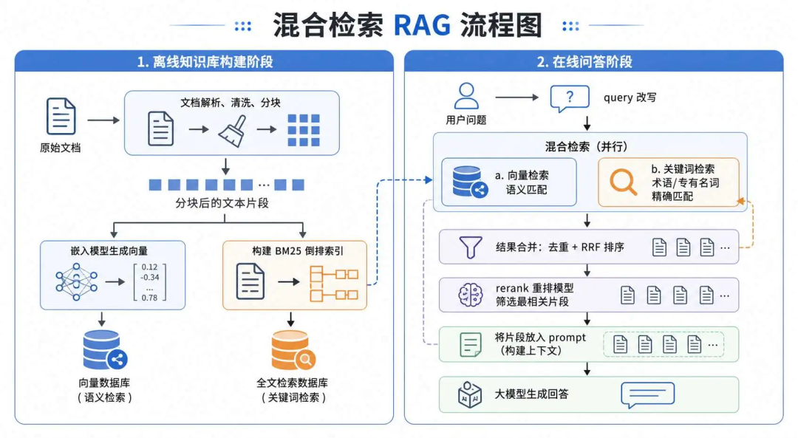
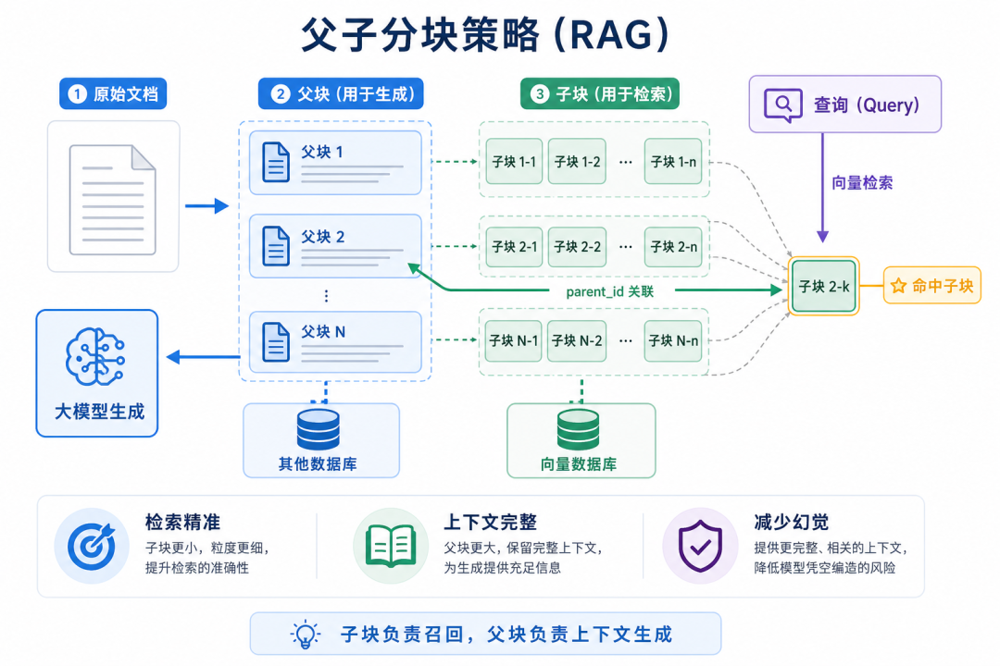
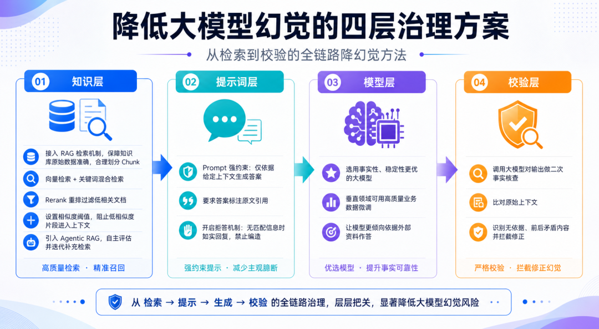
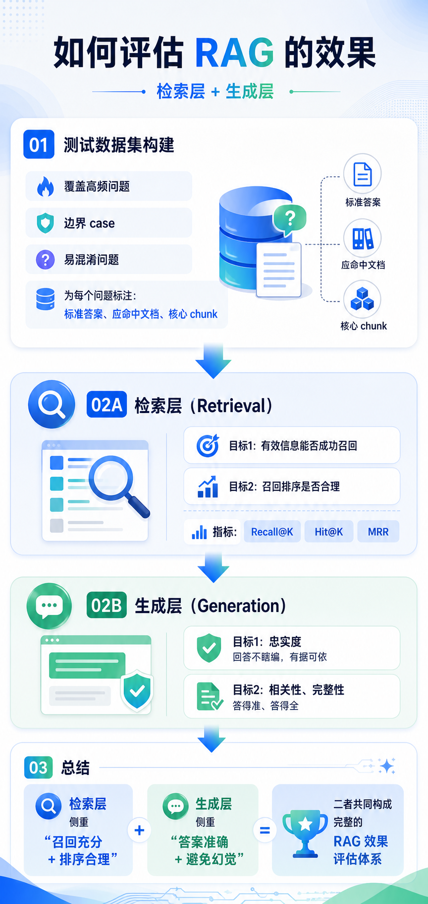

# RAG 面试题

## 本篇定位

本篇依据《Agent 面试题押题精讲：RAG 篇》整理为已有 RAG 课程的面试复习索引。它不重新教学 RAG，也不复制已有代码，复习路径是：

`Question → Answer → Principle → Lesson → Code`

原文实际包含 9 道题。下文的“原文要点”只概括原文表达；工程解释和覆盖判断结合当前仓库已有 Lesson，未从网络增加题目。

## 知识覆盖地图

| 面试题 | 核心知识 | 覆盖状态 | 对应 Lesson |
| --- | --- | --- | --- |
| Q1. 说一下 RAG 的流程 | 文档处理、Embedding、向量检索、BM25、混合检索、RRF、Rerank、生成 | 部分覆盖 | [Lesson 06 源码](../../lessons/06_rag-test/src/hello-rag.mjs)、[Lesson 09 源码](../../lessons/09_milvus-test/src/ebook-reader-rag.mjs)、[Lesson 29](../../lessons/29_langsmith-test/README.md) |
| Q2. 什么是 RRF 算法 | 多路召回的排名融合 | 未覆盖 | — |
| Q3. 你知道 Graph RAG 么 | 知识图谱、实体关系、多跳查询 | 已覆盖 | [Lesson 28](../../lessons/28_neo4j-graphrag/README.md) |
| Q4. 什么是 Agentic RAG | 路由、规划、工具调用、证据评估、迭代检索 | 已覆盖 | [Lesson 24](../../lessons/24_advanced-rag/README.md) |
| Q5. 你知道父子分块策略么 | parent/child chunk、检索上下文解耦 | 未覆盖 | — |
| Q6. 如何降低大模型的幻觉？ | 证据约束、拒答、阈值、评估和校验 | 部分覆盖 | [Lesson 24](../../lessons/24_advanced-rag/README.md)、[Lesson 29](../../lessons/29_langsmith-test/README.md) |
| Q7. RAG 如何做权限过滤？ | RBAC、metadata、retrieval-time filter | 未覆盖 | — |
| Q8. 如何评估 RAG 的效果 | Retrieval Evaluation、Generation Evaluation、指标 | 部分覆盖 | [Lesson 29](../../lessons/29_langsmith-test/README.md)、[Lesson 39](../../lessons/39_langfuse-test/README.md) |
| Q9. 为什么 Claude Code 不用 RAG 检索代码，而是用 grep？ | 精确搜索、实时文件、Agentic Search | 部分覆盖 | [Lesson 13 文件工具](../../lessons/13_mini_cursor/src/test/03-all-tools.mjs) |

## Q1. 说一下 RAG 的流程

### 30～60 秒回答

RAG 可以分成离线知识库构建和在线问答两阶段。离线阶段解析、清洗并切分文档，用 Embedding 生成向量，同时可以建立 BM25 倒排索引。在线阶段先改写问题，再做向量和关键词混合召回，按 chunk ID 去重，用 RRF 做排名融合，再用 Rerank 选出更相关的片段，最后把上下文交给模型生成回答。这样既利用语义匹配，也保留了术语和专有名词的精确匹配能力。

### 图解

### 核心原理

Embedding 把文本映射为向量，向量检索按语义相似度找片段；BM25 按词项和逆文档频率匹配关键词。两路分数尺度不同，不能直接相加，所以需要基于排名的融合策略。Rerank 位于候选召回之后，用更重的模型做精排。

### 工程意义

离线构建降低在线延迟，混合召回降低单一检索方式的盲点，Rerank 控制送入上下文的数量和质量，最后的引用或拒答策略帮助回答可核对。

### 对应 Lesson

- [Lesson 06 RAG 基础源码](../../lessons/06_rag-test/src/hello-rag.mjs)：Loader、分块、Embedding、向量存储和生成。
- [Lesson 06 分块与入库源码](../../lessons/06_rag-test/src/loader-and-spiltter.mjs)：文档切分和向量化入口。
- [Lesson 09 Milvus RAG 源码](../../lessons/09_milvus-test/src/ebook-reader-rag.mjs)：Milvus 向量检索、过滤和上下文生成。
- [Lesson 29 LangSmith RAG](../../lessons/29_langsmith-test/README.md)：入库、检索、生成和评估的课程化链路。

### 常见追问

- 为什么向量检索和 BM25 要同时使用？
- 为什么召回后还需要 Rerank？
- chunk ID 在多路召回中有什么作用？

### 常见误区 / 边界

- 当前仓库没有 BM25、RRF、Rerank 的完整实现，不能把这条完整混合链路标为已覆盖。
- `book_id` 过滤是数据范围过滤，不等于 RBAC 权限过滤。
- RAG 的“有上下文”不等于回答一定忠实，还需要生成层约束和评估。

### 当前仓库覆盖状态

部分覆盖：已有基础向量 RAG、Milvus 检索、分块和 LangSmith RAG 评估入口；缺少可复习的 BM25、RRF、Rerank 和 Query Rewrite 实现。

## Q2. 什么是 RRF 算法

### 30～60 秒回答

RRF 是 Reciprocal Rank Fusion，也就是倒数排名融合。向量检索和 BM25 的原始分数范围不同，不能直接加权相加；RRF 不看原始分数，只根据文档在每路结果中的名次计算贡献，把多路结果合并排序。融合后再截取候选交给 Rerank 做精排，能控制精排成本。

### 图解

### 核心原理

同一个 chunk 在不同列表中的排名越靠前，倒数排名贡献越大；通过 chunk ID 合并同一文档。它解决的是候选列表融合问题，不是相似度计算或生成质量问题。

### 工程意义

当语义检索和关键词检索各自擅长不同问题时，RRF 能在不校准分数尺度的前提下稳定利用两路结果，并把昂贵的精排限制在较小候选集。

### 对应 Lesson

当前没有 RRF 实现可链接。基础召回可先复习 [Lesson 06](../../lessons/06_rag-test/src/hello-rag.mjs) 和 [Lesson 09](../../lessons/09_milvus-test/src/ebook-reader-rag.mjs)。

### 常见追问

- RRF 为什么不直接融合原始 score？
- 去重应该发生在 RRF 前还是后？
- RRF 和 Rerank 的职责有什么不同？

### 常见误区 / 边界

RRF 是排名融合，不等于把两个原始 score 相加；它也不替代 Rerank，更不等于 BM25 或向量检索本身。

### 当前仓库覆盖状态

未覆盖：只有课程文档提到混合检索或 Rerank 的扩展方向，没有可核对的 RRF 代码或精确实现说明。

## Q3. 你知道 Graph RAG 么

### 30～60 秒回答

Graph RAG 在文本检索之外引入知识图谱。离线阶段从文档抽取实体和关系，建立图谱，同时保留文本索引；在线阶段既召回相关片段，也围绕问题中的实体遍历关系，把图谱链路和文本证据合并后交给模型。它适合需要跨文档、多跳关系推理的问题，不是所有普通问答都必须使用。

### 图解

### 核心原理

向量检索擅长相似片段，关键词检索擅长精确术语，图数据库擅长节点、关系方向和多跳路径。Graph RAG 的关键是把图查询结果作为证据接入生成工作流，并处理图谱缺失或查询失败。

### 工程意义

实体关系分散在多个文档时，仅返回相似片段可能无法组成完整链路；图谱可以提供结构化关系，但会增加抽取、维护和查询成本。

### 对应 Lesson

- [Lesson 28 GraphRAG 课程](../../lessons/28_neo4j-graphrag/README.md)：Neo4j、Cypher 和 LangGraph GraphRAG 工作流。
- [GraphRAG 入口源码](../../lessons/28_neo4j-graphrag/src/03-graphrag.mjs)：问题解析、生成 Cypher、图查询和回答。

### 常见追问

- Graph RAG 和向量 RAG 的边界是什么？
- 图谱数据从哪里来，如何处理实体抽取错误？
- 图查询为空时是否应该直接生成答案？

### 常见误区 / 边界

Graph RAG 不应该替代所有普通 RAG；图谱查询结果为空或不完整时不能让模型自行补全事实。

### 当前仓库覆盖状态

已覆盖：已有 Neo4j 图建模、Cypher 多跳查询和 LangGraph GraphRAG 入口；课程运行仍依赖外部 Neo4j 与模型服务。

## Q4. 什么是 Agentic RAG

### 30～60 秒回答

Agentic RAG 让模型参与检索决策，而不是固定执行一次检索。系统可以把本地检索、图谱检索或 Web 搜索封装成工具，根据问题进行路由或拆解，检查证据是否足够，不足时改写问题并继续检索，最后在受控条件下生成回答。实际项目通常会给循环次数、工具范围和停止条件设上限。

### 图解

### 核心原理

Agentic RAG 的变化在控制流：路由、规划、工具调用、证据评估和迭代重试成为状态图节点。模型负责语义判断，代码负责状态、枚举、循环上限和失败边界。

### 工程意义

简单问题可以跳过检索，复杂问题可以多跳或切换数据源；受限 workflow 能在效果、成本和可解释性之间取得平衡。

### 对应 Lesson

- [Lesson 24 Advanced RAG](../../lessons/24_advanced-rag/README.md)：naive RAG、问题路由、多跳、证据评估和 Web 回退。
- [Lesson 24 多跳源码](../../lessons/24_advanced-rag/src/02-multihop-rag.mjs)：子问题拆解、循环检索和停止上限。
- [Lesson 24 Web 回退源码](../../lessons/24_advanced-rag/src/03-web-fallback-rag.mjs)：证据不足时切换数据源。

### 常见追问

- 为什么不能让 Agent 无限检索？
- 路由、规划和证据评估分别解决什么问题？
- 如何避免 Web 回退引入低质量来源？

### 常见误区 / 边界

Agentic RAG 不等于完全开放的 Agent loop；必须限制工具、检索轮数、预算和停止条件。

### 当前仓库覆盖状态

已覆盖：Lesson 24 已有可运行的状态图示例，覆盖路由、多跳、证据评估和 Web fallback；它不代表已经把原文所有混合检索工具接成一个生产系统。

## Q5. 你知道父子分块策略么

### 30～60 秒回答

父子分块先把长文档切成较大的父块，再把父块切成更小的子块。子块携带 `parent_id` 做向量检索，命中后通过关联关系取回完整父块，把父块作为生成上下文。这样把“检索粒度”和“生成上下文粒度”解耦，兼顾召回精度和上下文完整性。

### 图解

### 核心原理

子块适合定位局部语义，父块提供连续上下文；系统要保证 parent/child ID、存储位置、权限和版本关系一致。长父块也要受到上下文窗口和噪声控制。

### 工程意义

直接向量化大块文本容易召回噪声，直接把很小的 chunk 给模型又可能缺少前后文。父子策略通过二次取数缓解这两个问题。

### 对应 Lesson

当前没有同时出现 parent document、child chunk、检索子块和生成父块的实现。可先复习 [Lesson 06 的分块源码](../../lessons/06_rag-test/src/loader-and-spiltter.mjs)，但它不是父子分块实现。

### 常见追问

- 父块是否需要向量化？
- 父块过大如何避免上下文超限？
- 父子关系如何和权限、版本、删除保持一致？

### 常见误区 / 边界

普通的文本切分或固定 chunk size 不等于父子分块；必须能看到父块、子块、关联 ID 和命中后的父块回取。

### 当前仓库覆盖状态

未覆盖：已有基础分块，但没有可确认的 parent/child retrieval context 链路。

## Q6. 如何降低大模型的幻觉？

### 30～60 秒回答

可以从知识、提示词、模型和校验四层处理。知识层保证数据质量、合理分块、混合召回、Rerank 和相似度阈值；提示词层要求只依据上下文回答，信息不足时拒答并引用来源；模型层选择稳定模型或做领域适配；校验层再对回答和原始证据做事实核查。核心是让模型有可靠证据，并允许它明确说不知道。

### 图解

### 核心原理

幻觉可能来自检索没找全、上下文含噪、提示词约束弱或生成内容未经核验。检索层的召回噪声、生成层的忠实度是两个不同问题，要分别观测。

### 工程意义

在客服、知识库和代码助手中，拒答、引用和二次校验比“让模型更自信”更能控制错误传播；每一层都需要可观测的失败信号。

### 对应 Lesson

- [Lesson 24 Advanced RAG](../../lessons/24_advanced-rag/README.md)：证据充分性评估、Web 回退和“资料不足时不编造”的 Prompt。
- [Lesson 29 RAG 评估](../../lessons/29_langsmith-test/README.md)：忠实度、检索相关性和有用性评估器。
- [Lesson 09 RAG 源码](../../lessons/09_milvus-test/src/ebook-reader-rag.mjs)：基于检索片段约束回答的 Prompt。

### 常见追问

- 如何区分检索失败和模型生成失败？
- 相似度阈值应该如何确定？
- 为什么增加上下文不一定能降低幻觉？

### 常见误区 / 边界

RAG 不是幻觉的自动保险；上下文越多可能噪声越大。LangSmith/Langfuse 的 trace 也只是观测基础设施，不等于已经完成幻觉评估。

### 当前仓库覆盖状态

部分覆盖：已有证据评估、拒答型 Prompt 和 LangSmith RAG 评估入口；缺少系统化的阈值实验、二次事实核查和可量化的完整治理链路。

## Q7. RAG 如何做权限过滤？

### 30～60 秒回答

可以采用 RBAC，把文档或 chunk 的可见角色、租户和公开标记作为 metadata。入库时继承父文档权限，查询时先解析当前用户角色，再把权限条件带入向量和关键词检索，只在有权范围内召回，之后才做 Rerank 和生成。权限过滤必须发生在 retrieval 阶段，不能先召回所有内容再靠 Prompt 隐藏。

### 图解

### 核心原理

权限是检索候选集的约束，至少要考虑 user、role、tenant、文档版本和公开状态；向量库与全文库的 metadata 规则必须一致，避免多路检索泄露不同范围的数据。

### 工程意义

先过滤可以减少越权风险，也避免无权文档污染排序和上下文。权限变更、撤权和缓存失效都要有明确策略。

### 对应 Lesson

当前没有 user/role/tenant metadata 与 retrieval-time permission filter 的实现。[Lesson 09 的 `book_id` filter](../../lessons/09_milvus-test/src/ebook-reader-rag.mjs) 只是按书籍范围筛选，不能作为 RBAC 示例。

### 常见追问

- 为什么不能只在生成 Prompt 里过滤？
- 多租户检索如何避免缓存串租户？
- 权限变化后已有向量和索引如何更新？

### 常见误区 / 边界

metadata 过滤不等于 RBAC；“有一个 filter 参数”也不代表完成了身份解析、租户隔离和撤权处理。

### 当前仓库覆盖状态

未覆盖：没有可链接的 RBAC、用户角色或 retrieval-time metadata 权限实现。

## Q8. 如何评估 RAG 的效果

### 30～60 秒回答

RAG 评估拆成检索层和生成层。先准备覆盖高频、边界和易混淆问题的数据集，并标注标准答案、相关文档和核心 chunk。检索层看 Recall@K、Precision@K、MRR、Hit@K，分别关注找全、噪声、排序和是否命中；生成层看 Faithfulness、相关性和完整性，判断回答是否有据、答题是否切题和覆盖要点。两层要分开看，不能只看最终文本分数。

### 图解

### 核心原理

Recall@K/Hit@K依赖相关文档标注，MRR关注首个正确结果的位置，Precision@K关注返回结果中噪声比例。Faithfulness、Answer Relevancy、Completeness 和 Context Utilization 通常需要 LLM-as-Judge 或人工复核。

### 工程意义

检索指标能定位“没找到”还是“排序靠后”，生成指标能定位“找到了但答错/答不全”。Dataset、trace 和 experiment 让提示词、模型、切分与检索策略可以回归比较。

### 对应 Lesson

- [Lesson 29 LangSmith RAG 评估](../../lessons/29_langsmith-test/README.md)：Dataset、OpenEvals、experiment，以及忠实度/检索相关性/有用性评估。
- [Lesson 39 Langfuse 评测](../../lessons/39_langfuse-test/README.md)：Dataset、Experiment、Evaluator 和 trace 关联。
- [Lesson 29 评估源码](../../lessons/29_langsmith-test/src/03_eval/evaluators.mjs)：生成层评估器入口。

### 常见追问

- Retrieval Evaluation 和 Generation Evaluation 为什么必须分开？
- LLM-as-Judge 如何防止评分偏差？
- 只有最终答案，没有相关 chunk 标注时还能算 Recall@K 吗？

### 常见误区 / 边界

LangSmith/Langfuse 的 trace 或 Dataset 不自动等于 Retrieval Evaluation；当前课程没有完整实现题目列出的 Recall@K、Precision@K、MRR、Hit@K 计算器。

### 当前仓库覆盖状态

部分覆盖：已有观测、Dataset、Experiment 和生成/检索相关性评估入口；缺少可核对的检索层四项指标实现与完整标注数据集。

## Q9. 为什么 Claude Code 不用 RAG 检索代码，而是用 grep？

### 30～60 秒回答

代码检索常需要精确匹配函数名、类名、变量名和报错字符串，grep 比语义相似度更直接；代码库又经常变化，维护向量索引可能滞后，而 grep 读取的是当前磁盘内容。更合适的模式是 Agentic Search：模型决定用 grep 查内容、glob 找文件名，再用 read 读取完整文件，信息不足时调整查询继续搜索。

### 图解

### 核心原理

向量 RAG 适合自然语言语义近似，代码搜索常把标识符和当前版本作为一等公民。工具调用把搜索过程变成可迭代的控制流，最终由 read 提供完整上下文，而不是只把相似片段交给模型。

### 工程意义

实时工具降低索引同步成本，也让结果能对应当前分支和工作区；但大型代码库仍可以结合符号索引、依赖图或语义检索，关键是按任务选择检索方式。

### 对应 Lesson

- [Lesson 13 文件工具](../../lessons/13_mini_cursor/src/test/03-all-tools.mjs)：已有 `read_file` 和目录枚举工具，可对照 Agent 调用文件工具的方式。
- [Lesson 13 多工具循环](../../lessons/13_mini_cursor/src/test/04-stream-mini-cursor.mjs)：可复习工具集合和模型驱动的工具调用。

### 常见追问

- grep、glob、read 分别解决什么问题？
- 代码搜索是否永远不需要向量检索？
- 如何限制 Agent 搜索范围和循环次数？

### 常见误区 / 边界

当前 Lesson 13 没有完整复刻 Claude Code 的 grep/glob/read Agentic Search，也不能据此宣称已验证 Claude Code 的历史技术决策；这里保留的是架构判断和相近的文件工具材料。

### 当前仓库覆盖状态

部分覆盖：已有 read_file、目录枚举和工具调用示例；缺少 grep/glob 的专门工具、增量索引对比和完整 Agentic Search 工作流。

## 复习顺序

1. 先看 [Lesson 06](../../lessons/06_rag-test/src/hello-rag.mjs) 和 [Lesson 09](../../lessons/09_milvus-test/src/ebook-reader-rag.mjs)，建立基础检索链路。
2. 再看 [Lesson 24](../../lessons/24_advanced-rag/README.md) 和 [Lesson 28](../../lessons/28_neo4j-graphrag/README.md)，比较受限 Agentic RAG 与 GraphRAG。
3. 最后看 [Lesson 29](../../lessons/29_langsmith-test/README.md) 和 [Lesson 39](../../lessons/39_langfuse-test/README.md)，区分 trace、评估数据集和指标。
4. 对 Q2、Q5、Q7 先记住 Gap；补课时回到最相关的已有 Lesson 设计实验。

详细的原文题目清单、覆盖判定和后续候选见 [REVIEW_NOTES.md](REVIEW_NOTES.md)。
