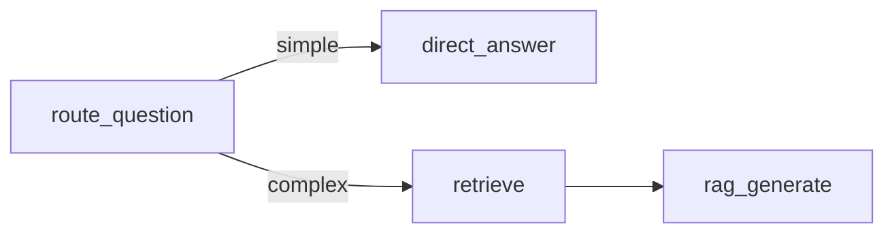
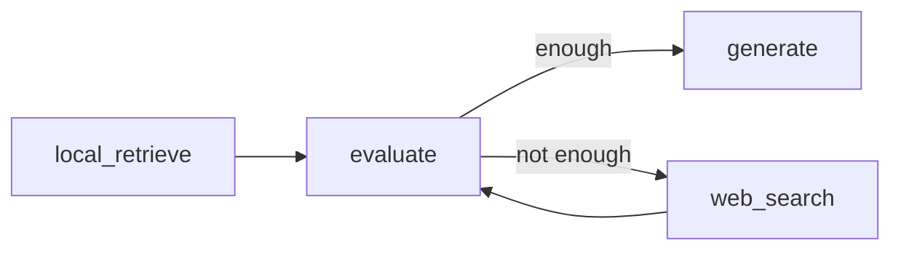

# 24 Advanced RAG：用 LangGraph 构建可决策的 RAG

本 lesson 对应公众号原稿中的 Agentic RAG 主线：从固定的“检索 → 生成”开始，依次加入问题路由、多跳检索、证据评估和 Web 回退。目标是理解 LLM 如何成为 RAG 流程的决策中枢，而不是把所有策略机械堆进一个系统。

## 1. 文章到底想教会什么

传统 RAG 会把所有问题都送去向量检索，无法判断证据是否充分，也无法主动补充知识。Agentic RAG 使用模型控制分支和循环，使系统能够决定：

- 是否需要检索；
- 复杂问题应该拆成哪些子问题；
- 当前证据是否足够；
- 是否继续检索或切换到 Web；
- 什么时候停止并生成答案。

生产系统不一定采用完全开放的 Agent 循环。意图识别、固定 workflow、多通道并行检索和结果融合组成的“受限 Plan-and-Execute”方案，通常更可控。

## 2. 目录与运行顺序

```text
24_advanced-rag/
├─ README.md
├─ REVIEW_NOTES.md
├─ package.json
└─ src/
   ├─ _shared/
   │  ├─ prompts.mjs
   │  ├─ runtime.mjs
   │  └─ schemas.mjs
   ├─ 00-naive-rag.mjs
   ├─ 01-query-router-rag.mjs
   ├─ 02-multihop-rag.mjs
   ├─ 03-web-fallback-rag.mjs
   └─ 04-local-fallback-rag.mjs
```

| 顺序 | 示例                        | 学习目的                 | 新增能力                                |
| ---- | --------------------------- | ------------------------ | --------------------------------------- |
| 00   | `00-naive-rag.mjs`          | 建立传统 RAG 对照组      | 固定检索 → 生成                         |
| 01   | `01-query-router-rag.mjs`   | 避免简单问题浪费检索     | simple/complex 条件分支                 |
| 02   | `02-multihop-rag.mjs`       | 处理链式事实问题         | 子问题拆解、循环检索、停止上限          |
| 03   | `03-web-fallback-rag.mjs`   | 本地证据不足时补充资料   | 充分性评估、Web 数据源回退              |
| 04   | `04-local-fallback-rag.mjs` | 外部服务不可用时复习主线 | 纯本地路由、片段选择、评估、Prompt 组装 |

## 3. 四个核心流程

### 00 传统 RAG


结构最简单，但所有问题都连接 Milvus，也没有证据评估和纠错能力。

### 01 问题路由



`addConditionalEdges` 根据结构化路由结果选择分支。Milvus 延迟到 `retrieve` 节点连接，因此 simple 分支不会占用检索资源。

### 02 多跳检索


先生成有序、无代词的子问题，再逐轮检索。模型决定是否继续，代码使用 `maxRetrievals` 提供不可突破的循环上限。

### 03 评估与 Web 回退



本地小说资料不足时，评估器生成 `webQuery`，博查返回带 URL 的网页摘要，再进行一次评估并生成答案。示例最多联网一次。

## 4. 环境与外部服务边界

环境变量统一来自仓库根目录 `.env`，不要在 lesson 目录单独创建 `.env`：

```text
OPENAI_API_KEY=
OPENAI_BASE_URL=
MODEL_NAME=
EMBEDDINGS_API_KEY=
EMBEDDINGS_BASE_URL=
EMBEDDINGS_MODEL_NAME=
EMBEDDINGS_DIMENSIONS=1024
MILVUS_ADDRESS=localhost:19530
BOCHA_API_KEY=
```

Milvus 属于用户管理的外部服务，本项目没有用于启动它的 Docker 编排。本次只完成静态检查和本地图编译，没有宣称 Milvus 或 Web 链路已经完整运行。

运行 00～03 前还需要：

1. 用户自行准备可连接的 Milvus；
2. 先运行 lesson 09 的 `src/ebook-writer.mjs`，写入《哈利波特与魔法石》；
3. collection 为 `ebook_collection`，向量维度为 1024；
4. 文档 `book_id` 为 `harry_potter_and_philosophers_stone`。

## 5. 按依赖强度运行

### 5.1 语法检查

无需 API Key，也不会连接外部服务：

```powershell
npm run check --prefix lessons/24_advanced-rag
```

### 5.2 无需 API Key，可直接运行

```powershell
node lessons/24_advanced-rag/src/04-local-fallback-rag.mjs
```

该示例不会调用模型、embedding、Milvus 或 Web API，只打印选中的本地片段和最终组装的 Prompt。

### 5.3 需要模型 API

01 的 simple 分支只需要模型 API：

```powershell
node lessons/24_advanced-rag/src/01-query-router-rag.mjs "什么是向量数据库？"
```

### 5.4 需要模型 API、embedding API 和 Milvus

```powershell
node lessons/24_advanced-rag/src/00-naive-rag.mjs
node lessons/24_advanced-rag/src/01-query-router-rag.mjs "哈利第一次见到海格时发生了什么？"
node lessons/24_advanced-rag/src/02-multihop-rag.mjs
```

### 5.5 还需要 Web API 和网络

```powershell
node lessons/24_advanced-rag/src/03-web-fallback-rag.mjs
```

除上述模型和 Milvus 条件外，还需要 `BOCHA_API_KEY`。

### 5.6 fallback 复习路径

Milvus 出现 `ECONNREFUSED`、collection 不存在、模型额度不可用或网络受限时，先运行 `04-local-fallback-rag.mjs`。重点观察：

```text
route -> local_retrieve -> evaluate -> build_rag_prompt
```

它不模拟真实向量相似度和生成质量，但完整保留“选择资料 → 组装上下文 → 形成 Prompt”的 RAG 学习链路。

## 6. State 与结构化输出速查

| 字段                               | 用途                                        |
| ---------------------------------- | ------------------------------------------- |
| `strategy`                         | 控制 simple/complex 或 direct/retrieve 分支 |
| `documents`                        | 保存当前或累计检索结果                      |
| `subQuestions`                     | 保存多跳检索的有序子问题                    |
| `nextSubQuestionIndex`             | 指向下一条未检索子问题                      |
| `retrievalCount` / `maxRetrievals` | 控制循环次数                                |
| `plannedNext`                      | 控制继续检索或生成                          |
| `localContext` / `webContext`      | 区分本地和联网证据                          |
| `evaluation`                       | 保存资料充分性判断                          |

路由、拆解、规划和评估会影响图的控制流，因此使用 `withStructuredOutput` 和 Zod 将输出限制为稳定字段。模型负责语义判断，代码负责枚举值、数量限制和循环上限。

## 7. 常见报错

- `ECONNREFUSED ...:19530`：Milvus 未启动或 `MILVUS_ADDRESS` 错误；改跑 04。
- `collection not found`：lesson 09 尚未写入 `ebook_collection`。
- `dimension mismatch`：embedding 输出维度不是 1024。
- 检索结果为空：检查新书的 `book_id` 是否一致。
- 缺少 `BOCHA_API_KEY`：仅 03 无法执行；00～02 和 04 不受该变量影响。
- 路由结果不稳定：这是模型判断；可收紧提示词或增加规则前置路由。
- 多跳提前结束：规划节点认为证据足够；可在业务中增加必须覆盖的事实清单。

## 8. 复习建议

1. 先运行 04，在无外部依赖的情况下理解 state 如何流过节点。
2. 再按 00 → 03 阅读，比较每个文件比前一个多出的节点和条件边。
3. 手动画出四张图，并解释每个硬性停止条件。
4. 思考生产系统为什么常采用固定 workflow 的受限 Agentic RAG，而不是完全开放循环。

完整的文章对应关系、整理原因和自检记录见 `REVIEW_NOTES.md`。
