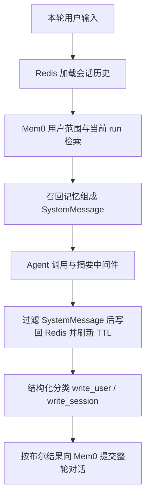

# Mem0 复习记录

> 验证边界：Redis、Mem0 自托管数据库和 Docker 是外部前置条件 / TODO。本次没有服务启动、真实模型调用、远程记忆 CRUD 或持久化验证，不能把源码检查视为全链路已通过。

## 材料与学习主线

文章中的部署、运行和清理命令只作为学习材料。

文章从“只有短期消息和语义检索不够”出发，依次讲云端 API、身份 scope、Redis + Mem0 + Agent、自托管 REST 服务，目标是让 Agent 跨会话复用用户信息。

## 原路径 → 编号路径

| 原路径（文章对照用）              | 当前路径                             | 知识点                                        |
| --------------------------------- | ------------------------------------ | --------------------------------------------- |
| `src/mem0-test.mjs`               | `src/00-mem0-test.mjs`               | 云端基础 CRUD                                 |
| `src/mem0-scoped-memory-test.mjs` | `src/01-mem0-scoped-memory-test.mjs` | user / session / agent                        |
| `src/mem0-redis-mem0-agent.mjs`   | `src/02-mem0-redis-mem0-agent.mjs`   | 分层记忆接入 Agent；文章创建段省略了 src 前缀 |
| `src/mem0-local-pai-demo.mjs`     | `src/03-mem0-local-pai-demo.mjs`     | 自托管 REST；保留原 basename 的 pai 拼写      |

实际移动四个文件，未复制第二套实现，没有发现需要保留旧路径的外部引用；命令、提示和 package 脚本同步更新。按名称排序为 00 → 01 → 02 → 03，连续等宽。

```text
34_mem0-test/
├── README.md
├── REVIEW_NOTES.md
├── docker-compose.yml
├── mem0/                         # 已有上游完整项目，保留其内部命名
├── package.json
└── src/
    ├── 00-mem0-test.mjs
    ├── 01-mem0-scoped-memory-test.mjs
    ├── 02-mem0-redis-mem0-agent.mjs
    └── 03-mem0-local-pai-demo.mjs
```

README / REVIEW_NOTES、配置、公共模块不参与编号。`mem0/` 是已有完整上游仓库，不对其示例或框架文件编号；学习位置在 03 之后，阅读顺序为 `server/main.py` 的请求模型与路由 → `mem0/memory/main.py` 的 search → `_search_vector_store` → `_compute_entity_boosts` → 向量存储与打分实现。它内部的 Markdown 不受本课根目录“两份文档”限制。

## 调用链复习



回答和分类至少是两个模型阶段，摘要触发时可能额外调用模型；每轮还会发起两次 Mem0 search。分类后 add 是提交，不保证马上可搜到。Redis 写回先于分类，因此后半段失败时，短期历史可能已保存；这里没有跨存储事务。

`messagesForRedis` 排除所有 SystemMessage / SystemMessageChunk，避免每轮召回内容反复写入短期历史。摘要触发阈值是 8 条消息，保留 4 条消息；消息数减少只是线索，不能仅凭终端日志认定压缩成功。

## 文章与当前实现的区别

1. **scope 不是三个自动互斥的桶。** 01 与 02 保留原文 `filters: { user_id }`。带同一 user_id 的会话记忆仍可能被这条宽查询召回；两路结果也未去重。严格区分用户事实与临时任务，需要明确存储标签、过滤策略和验证用例，作为后续 TODO，本次未擅自重构。
2. **分类决定目的地，没有拆分事实。** `write_user` 与 `write_session` 同时为 true 时，完整对话会分别提交到两层，临时内容仍可能进入用户范围。还需防止把助手未获用户确认的推测持久化。
3. **重启不等于新会话。** 原测试注释“新会话 Redis 是空的”已在相邻位置更正：同一 ID 且 TTL 未过期会恢复历史；需显式清 Redis 或换 ID，再观察行为，且不能忽略 user_id 的宽过滤。
4. **Redis TTL 只管理 Redis。** 每次 save 重新设置 EX；Mem0 的 run_id 不意味着自动过期。会话结束清理、过期策略与并发写回仍是教学边界。
5. **删除范围比“当前会话”更广。** `deleteAll({ userId })` 可能删除该用户全部会话；紧接着删指定 run 可能重复。固定演示 ID 也会复用以前的数据，本次没有执行任何清理命令。
6. **基础脚本默认查询。** 当前 00 的 add、update、history 已被用户保留为注释，本次不自动启用。样本也放进注释块以避免未使用变量；其上海样本区别于文章北京样本，保留不覆盖。
7. **记忆文本语言与检索问题语言不是同一设置。** “中文回答”作为 search query 不是生成提示；不能据此保证存储为中文。SDK 顶层 camelCase 与 filters snake_case 也不能混用。
8. **Redis key 只包含 session ID。** 多用户若复用 session ID，短期历史可能冲突；33 课与本课默认前缀相同。复习时使用独立测试前缀和 session ID；尚未实现认证隔离或生产级并发保护。

### “三路召回”核对证据

检查对象是已有 `mem0/` 工作树，HEAD 为 `02f7a9b2`，结论只覆盖所读源码，不能代表托管平台内部实现：

- [初始化](mem0/mem0/memory/main.py)：reranker 仅在有配置时创建；不支持 keyword_search 的存储会给出 BM25 降级警告。
- 同文件 `search` → `_search_vector_store`：先向量召回，再取关键词分数、归一化 BM25，并计算实体 boost，传入 `score_and_rank`。
- 候选集由语义结果构建，不能把这些评分信号简单理解成三个独立结果集全部融合。
- `_compute_entity_boosts` 用实体向量匹配和 `linked_memory_ids` 为关联记忆加权；这不是已验证的知识图谱多跳推理。
- rerank 需要启用并有可用 reranker；普通融合排序不等于总会执行单独重排模型。
- [服务端 SearchRequest 和路由](mem0/server/main.py) 使用 `filters` / `top_k`，与本课 03 的请求映射一致；真实认证、数据库、服务返回仍未验证。

因此保留文章“语义、关键词、关联信息互补”的学习价值，但将“原生默认完整图谱三路召回 + 重排”标记为需结合版本、配置及服务核实的表述。

## 整理修改及共享检查

- `lessons/_shared/mem0-client.mjs`：按用户指定移至跨课程共享目录，00 / 01 / 02 通过 `@lessons/shared/mem0-client` 复用初始化与缺失 Key 报错；包导出、依赖、锁文件与检查命令同步更新。当前使用方是三个文件，迁移按用户明确要求执行。
- 简单日志包装不值得单独建工具模块，log 函数已放回 00 / 01 / 03，删除课内 utils.mjs 及空的 src/_shared 目录。
- 四个入口统一复用 `lessons/_shared/env-loader.mjs`；02 的两个模型复用 `lessons/_shared/model.mjs` 的 `createChatModel`。跨课程环境/模型能力已超过三个 lesson，并且仓库已完成公共提取，本次直接复用，不再新建副本。
- 跨 lesson 搜索了 MemoryClient、日志工具、RedisMessageStore、模型初始化、环境加载及摘要 prompt。自有课程里 Mem0 初始化和该日志函数集中在本课；RedisMessageStore 在 33 / 34 两课出现，按使用文件统计未触发超过三个文件的强制提取。保留两个课程各自的核心消息读写教学结构，不让 34 import 33 的编号入口。
- schema 和分类 prompt 仅本例使用，留在 02；33 的摘要目标与本课不同，不合并。00 的上海与 03 的北京样本保留原入口教学对照，虽结构类似，不为了抽离改变既有数据。
- 修正 03 的 `returnthis.request` / `thrownewError` 富文本错误；前者可能通过语法检查却在执行时 ReferenceError。补充空 HTTP 错误响应的 null 判断，避免掩盖原始状态码；新增可选 `MEM0_LOCAL_BASE_URL`，默认地址不变。
- 02 保留流程，补充 Redis 连接失败清理及交互异常时的资源释放；压缩提示改为有证据边界的表述。
- 补齐脚本、根包缺少的 `mem0ai` 声明，沿用锁中 3.0.8，不升级现有依赖。课程依赖移交根包，避免本课独立 node_modules；pnpm 语法检查曾自动同步工作区并生成本课目录，完成后已清理。
- 合并原 TODO 有效内容如下，删除旧 TODO.md，课程根只留 README / REVIEW_NOTES；原文和当前源码有效注释保留，错误注释旁增加更正，没有静默抹去学习信息。

## 原 TODO 学习进度与外部部署待办

原记录是历史进度，不代表现在仍只读到 1/5：当时已理解 Redis 短期 / Mem0 长期分工，在后半段 Redis、Docker、LangChain 综合实战处暂停；原因是前置知识不足，工程跨度较大。

原已掌握概念：User 记录姓名、城市、偏好、习惯；Session 记录当前任务；Agent 记录角色、语气、领域；Redis 可先理解为短期缓存；Mem0 封装长期记忆检索。原 TODO 对“三路能力”的笼统描述按上文加上版本边界，去掉不可用的引用占位符。

继续顺序：先复习云端 add / search / getAll → 回看 33 课 key-value、TTL、ioredis → 再读综合 Agent → 最后考虑本地部署。不要求先读完综合例子。暂不部署本地 Mem0、不研究 RedisInsight、不深挖图谱、不把完整示例直接接入自己的业务。

外部前置条件 / TODO：

- 文章下载源码和在 server 下启动 Docker 的步骤需要用户另行准备环境。已有本课 Redis Compose 和上游 server Compose 均未启动。
- PostgreSQL 的 host / port / db / user / password / collection、默认 LLM 与 embedder、管理 API Key、JWT、认证开关、Dashboard 地址、遥测及日志保留设置，由服务端自行配置；不复用文章示例密码或 JWT，不修改现有真实 `.env`。
- 文章的 pnpm 10.5.2 / onlyBuiltDependencies 配置属于上游部署参考，不覆盖当前项目 pnpm 11.7.0 配置。
- 端口映射、认证方式、中文记忆提取、配额、实际检索得分、session 清理和跨会话隔离都需要在可用环境中单独验证。本次不预设成功结果。

## 自检记录

- 四个编号连续等宽，路径引用已更新；旧路径仅在映射表保留。没有编号示例互相 import。
- 四个本课入口与一个共享客户端 `.mjs` 的 `node --check`、导入解析、限定规则 ESLint（no-undef / no-unused-vars）全部通过；Prettier 格式检查通过。
- REST 客户端离线检查通过：add / search / list / delete 参数映射、认证头、JSON / 文本 / 空错误响应与空成功响应。检查用替身 fetch，无网络连接，不代表服务端 CRUD 通过。
- 根依赖具名导出检查、package / lock importer 一致性、文档相对链接检查和 `git diff --check` 通过。本课为 MJS，未运行仓库无关的 TypeScript 构建或上游服务测试。
- 课程根仅 README.md / REVIEW_NOTES.md；上游完整仓库作为例外保留。
- 根包和锁补齐 Mem0 依赖，本课不保留 node_modules；没有新增子课程锁文件、环境示例文件或 fallback。
- README 已分类云端 Key、模型 API、外部数据库/服务依赖，说明根 `.env` 来源、默认参数、运行命令、常见失败和无服务复习路径。
- 未运行数据库、Docker、Redis、Mem0 云端或真实 Agent 对话；没有声称部署、CRUD、持久化、检索效果已验证。
