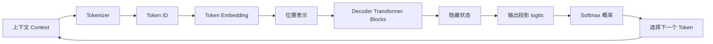
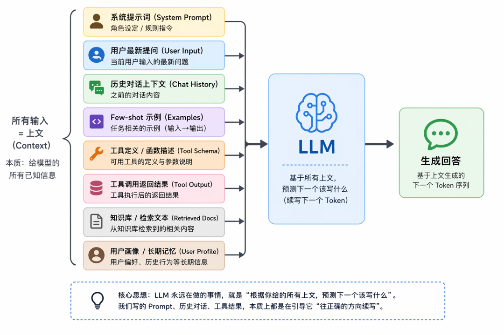
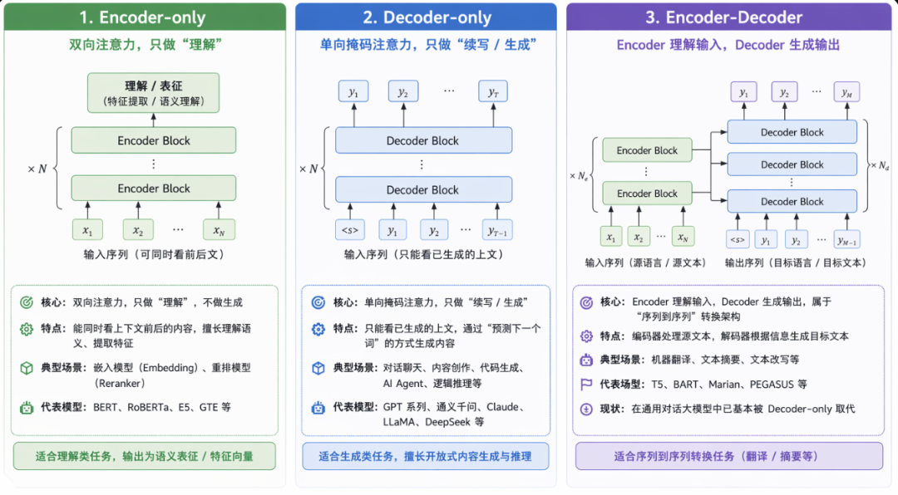
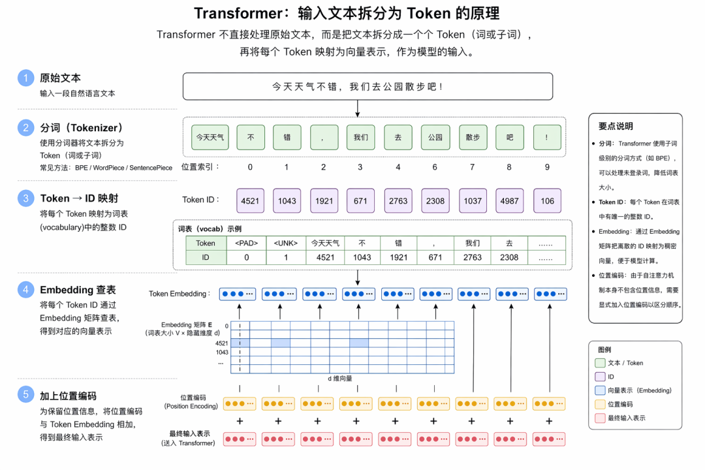
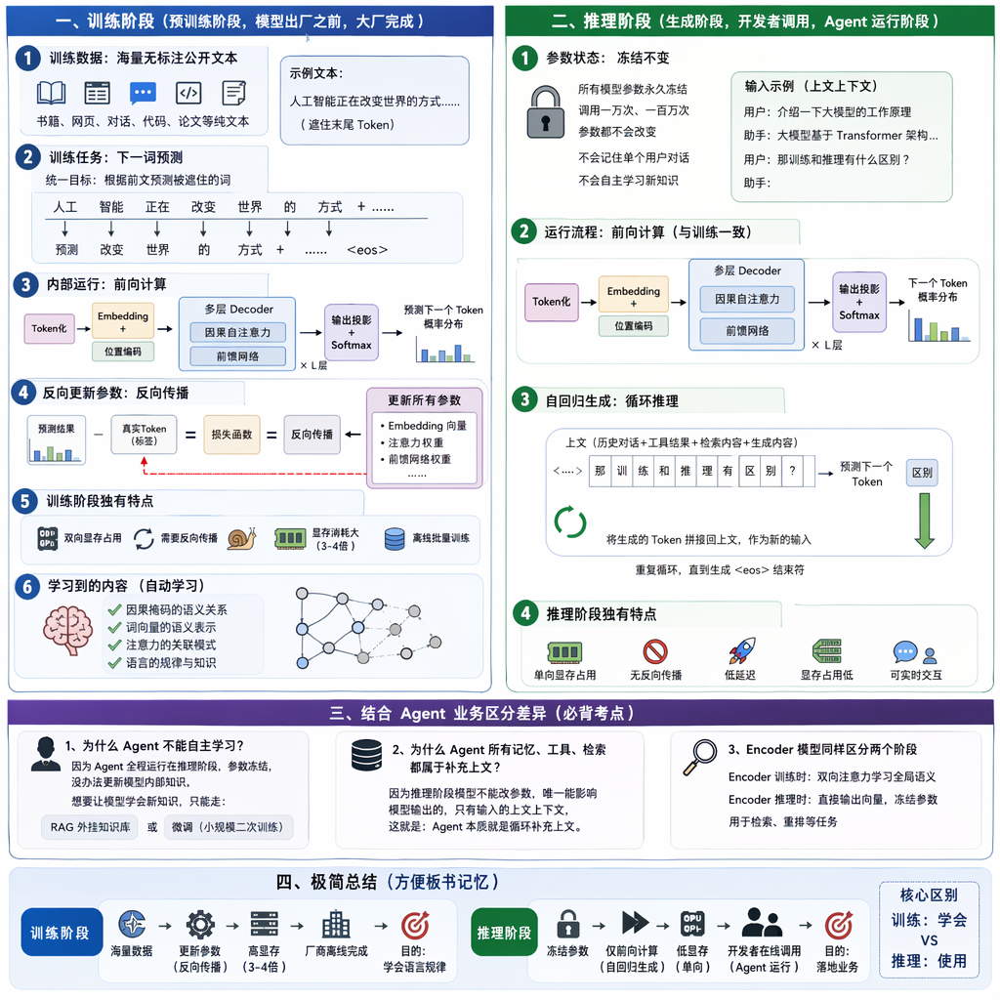

# Lesson 40：Transformer 与大模型原理

这是一节纯理论课，用来把前面 Agent、RAG、工具调用和记忆课程中的“模型黑盒”拆开看。重点是建立一条可复述的链路：上下文进入模型，经过 Token 化、Embedding、位置表示和 Transformer 层，最后通过输出投影与概率分布逐 Token 生成结果。

本课没有可运行的 `src/` 或 `package.json`，不需要为了理论内容编造 demo。配图保存在 `assets/`，用于复习架构和数据流；正文中的结论已在 `REVIEW_NOTES.md` 中补充适用边界。

## 复习顺序

1. 先看 `assets/01-agent-overview.png`，回顾 Agent 为什么围绕 LLM 循环。
2. 再看 `assets/03-context-is-input.png`，理解 Prompt、工具结果、检索文档和记忆都会成为上下文。
3. 阅读 `assets/04-transformer-architectures.png`，区分 Encoder-only、Decoder-only 和 Encoder-Decoder。
4. 阅读 `assets/08-tokenization-pipeline.png`、`assets/09-decoder-generation-pipeline.png`，跟踪文本如何进入 Decoder 并生成 Token。
5. 最后阅读 `REVIEW_NOTES.md` 的训练/推理、输出投影、Softmax 和面试问答部分。

## 核心流程

## 和前面课程的联系

- Agent 的 System Prompt、用户消息、历史对话、工具 Schema、工具结果、检索文档和长期记忆，都会作为模型可见的上下文参与下一步生成。
- Decoder-only 模型主要负责对话、规划、工具调用和最终回答。
- Encoder-only 模型常用于 Embedding、语义匹配和重排；在 RAG 中通常与生成模型配合。
- Agent 的循环不会直接修改模型权重，而是不断更新上下文并再次调用模型。

## 运行与外部依赖

本课无需 API Key、数据库、Docker 或外部服务。推荐直接阅读 Markdown 和 `assets/` 配图。若要观察真实 Token、logits 或推理过程，需要额外的模型服务或 Tokenizer 工具，这些不属于本课已验证的运行路径。

图片来自本课学习材料，文件名按知识点整理。后续若需要公开发布，应优先使用 Mermaid 或自行绘制的等价图示。
