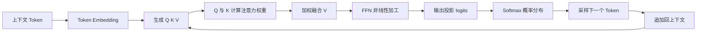

# Lesson 41：QKV 注意力、KV Cache 与生成控制

这是一节纯理论课，是第 40 课 Transformer 总览的深入部分。课程沿着一次 Decoder 生成继续拆解：Token 经过 Q、K、V 自注意力完成上下文融合，经过 FFN 加工，再由输出投影和 Softmax 得到下一 Token 的概率；推理时用 KV Cache 减少历史计算，采样策略控制生成的稳定性和多样性。

本课没有可独立运行的 `src/` 或 `package.json`。正文没有完整代码，只有一张关于 `ChatOpenAI` 的参数截图；该片段已在 `REVIEW_NOTES.md` 中按上下文记录，不能据此假设完整模型服务已经可运行。17 张配图保存在 `assets/`，用于复习数据流和训练/推理阶段。

## 复习顺序

1. 先回顾 `assets/01-qkv-attention-overview.png`，把本课放回 Transformer 和 Agent 的上下文。
2. 阅读 `assets/02-qkv-query-key-value.jpeg`、`assets/03-attention-weighted-values.png`，理解 Q 查询、K 匹配、V 内容以及加权求和。
3. 阅读 `assets/04-ffn-and-output-projection.png`、`assets/05-decoder-generation-chain.jpeg`，跟踪注意力之后的 FFN、输出投影和 Softmax。
4. 阅读 `assets/06-kv-cache-overview.png`、`assets/07-kv-cache-step-by-step.png`，理解 Prefill、逐 Token Decode 和缓存追加。
5. 阅读 `assets/09-training-dataset-loss-backprop.jpeg`、`assets/10-training-to-inference-flow.png`，区分训练和推理。
6. 最后阅读 `assets/11-sampling-strategies.png` 到 `assets/16-generation-controls.png`，比较 Greedy、Top-K、Top-P 和 Temperature。

## 一次生成的核心流程

## 依赖与运行边界

本课是理论课程，无需 API Key、数据库、Docker 或外部服务。只需阅读 Markdown 和 `assets/` 配图。图片中的 `ChatOpenAI` 片段依赖模型 API 配置，但没有提供完整调用入口，因此不单独声明为可运行示例。

文章提到 GPU、数据集、损失函数、反向传播和 KV Cache，这些是原理说明，不代表本仓库已经提供训练框架、GPU 环境或推理引擎实现。

## 与第 40 课的关系

- 第 40 课回答“Transformer 有哪些形态，以及文本如何进入模型”。
- 第 41 课回答“Decoder 内部怎样用 QKV、FFN 和 KV Cache 处理每一轮生成”。
- 第 40 课的上下文观点在本课继续成立：Agent 的 Prompt、工具结果、检索文档和记忆会影响模型看到的上文，但不会因为拼接进上下文就自动更新参数。
